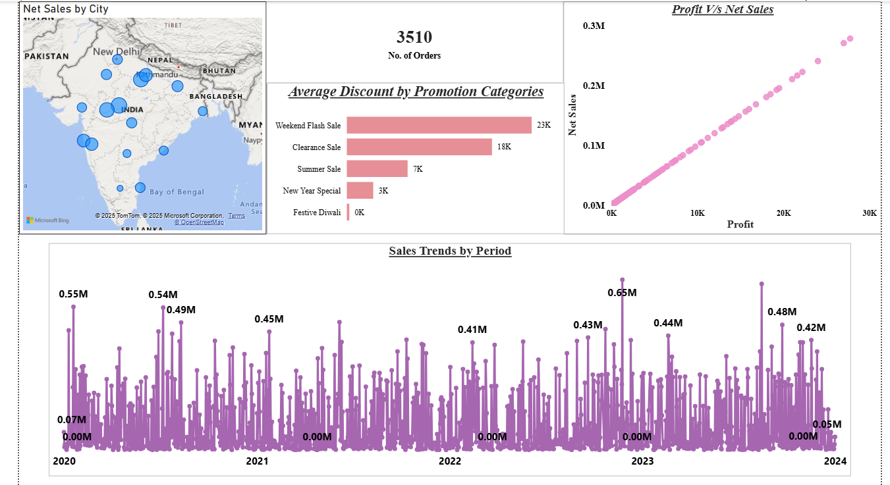
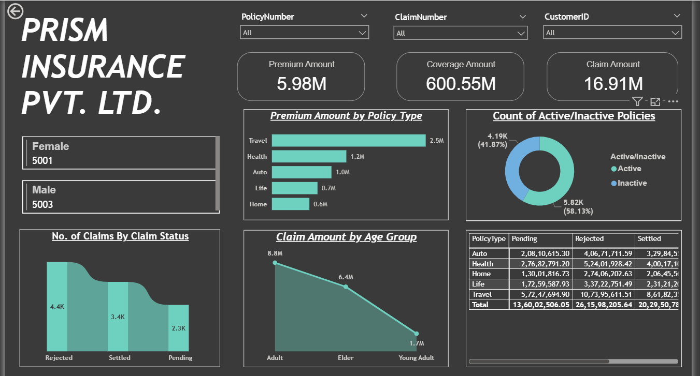

#  Data Analyst · Business Analyst · Prompt Engineer · AI Solutions Consultant

## 👋 About Me
A results-driven professional passionate about translating complex data and emerging AI technologies into clear, actionable business insights. Experienced in crafting dynamic dashboards, streamlining workflows, and designing intelligent solutions that drive strategic decisions and operational efficiency. Continuously learning and innovating to help organizations unlock greater value from their data and AI investments.

## 💻 Tech Stack
Power BI, Advanced Excel, SQL, MySQL, Python  
Data Visualization, DAX, Power Query, REST API, EDA, Prompt Engineering  
Machine Learning: Scikit-learn, Jupyter Notebook, Pandas, NumPy

## 🌟 Highlights

- Led development of interactive Power BI dashboards that improved stakeholder productivity and reporting speed by over 40% during internships.
- Designed and automated machine learning workflows, reducing manual effort by 35% through effective use of Python and data tools.
- Achieved the highest tier in Google Cloud Arcade (2025); skilled in cloud data handling and dashboard deployment.
- Proactive, collaborative, and continuously learning—committed to delivering data solutions that drive growth and efficiency.

## 🚀 Portfolio Projects

### Interactive Sales Performance Report (Power BI)
Transformed fragmented sales data into unified, KPI-driven reports. Reduced manual reporting by 45% and improved profitability for clients using advanced Power Query, DAX, and visualization techniques.

### Insurance Analysis Dashboard (Power BI)
Built secure dashboards for portfolio analysis, halving reporting time and adding sentiment analysis for actionable business decisions.

### UPI Transactions Trends (Power BI)
Leveraged analytics to uncover transaction and user behavior patterns, achieving a 30% reduction in analysis time with interactive slicers and bookmarks.

### Sales Performance Dashboard (Excel)
Processed and cleaned 2,000+ rows of sales data with VLOOKUP and PivotTables, enabling rapid analysis and facilitating real-time business insights.

## 🏆 Achievements & Certifications

- 🥇 Highest Tier – Google Cloud Arcade Program (2025)
- 🏅 ChatGPT Prompt Engineering for Developers – DeepLearning.AI (2024)
- 📈 Complete Data Analyst Bootcamp – Udemy (Ongoing)

## 🎓 Education

- B.Tech Computer Science Engineering | Manav Rachna University (2022–2026), CGPA: 7.1/10
- Senior Secondary | D.A.V. Public School (2022), 75%
- Secondary | D.A.V. Public School (2020), 85%

## 🌐 Connect

- [LinkedIn](https://linkedin.com/in/anshulsemwal7)

---

_Bringing clarity to data. Delivering business impact. Always learning._
